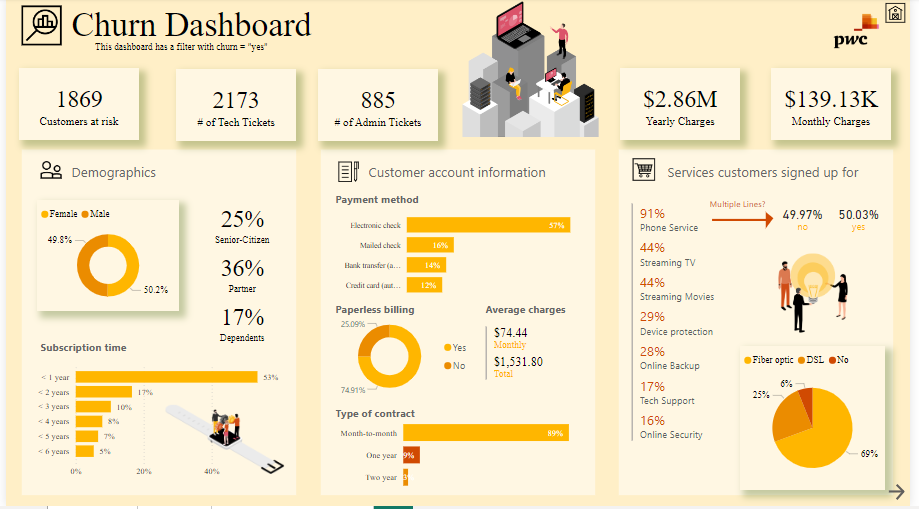
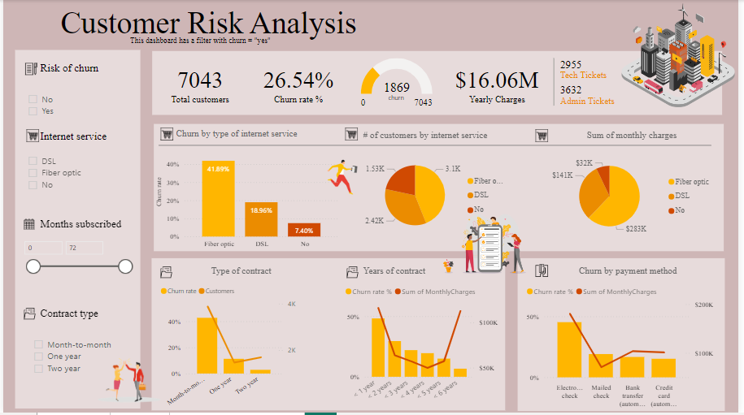

# PhoneNow Customer Retention Project

## Overview
This project focuses on analyzing customer churn for **PhoneNow**, a telecommunications provider, with the goal of improving customer retention strategies. The tasks involved defining KPIs, building visual dashboards, and providing insights and recommendations based on the data.

## Client Request
The engagement partner provided specific inputs for this project. The client’s retention manager outlined the scope in an email, requesting the development of KPIs and dashboards to monitor customer churn and related metrics.

You can view the client request in PDF format here:
- [Download Client Email Request (PDF)](https://cdn.theforage.com/vinternships/companyassets/4sLyCPgmsy8DA6Dh3/PhoneNow%20inputs%20(3).pdf)

### Dataset
The raw dataset used for this analysis includes several important fields such as customer demographics, services used, payment details, and whether a customer has churned.

You can download the dataset here:
- [Download Raw Dataset (Excel)](https://cdn.theforage.com/vinternships/companyassets/4sLyCPgmsy8DA6Dh3/02%20Churn-Dataset.xlsx)

**Dataset column headers:**
- `customerID`, 
- `gender`, 
- `SeniorCitizen`, 
- `Partner`, 
- `Dependents`
- `tenure`, 
- `PhoneService`, 
- `MultipleLines`, 
- `InternetService`, 
- `OnlineSecurity`
- `OnlineBackup`, 
- `DeviceProtection`, 
- `TechSupport`, 
- `StreamingTV`, 
- `StreamingMovies`
- `Contract`, 
- `PaperlessBilling`, 
- `PaymentMethod`, 
- `MonthlyCharges`, 
- `TotalCharges`
- `numAdminTickets`, 
- `numTechTickets`, 
- `Churn`


## Here is a brief definition of the dataset column headers:

- `customerID`: Unique identifier assigned to each customer.

- `gender`: Gender of the customer (Male or Female).

- `SeniorCitizen`: Indicator if the customer is a senior citizen (1 for Yes, 0 for No).

- `Partner`: Indicator if the customer has a partner (Yes or No).

- `Dependents`: Indicator if the customer has dependents (Yes or No).

- `tenure`: The number of months the customer has been with the company.

- `PhoneService`: Indicator if the customer subscribes to phone services (Yes or No).

- `MultipleLines`: Indicator if the customer has multiple phone lines (Yes, No, or No Phone Service).

- `InternetService`: Type of internet service subscribed (DSL, Fiber optic, or No).

- `OnlineSecurity`: Indicator if the customer subscribes to online security services (Yes or No).

- `OnlineBackup`: Indicator if the customer subscribes to online backup services (Yes or No).

- `DeviceProtection`: Indicator if the customer subscribes to device protection services (Yes or No).

- `TechSupport`: Indicator if the customer subscribes to technical support services (Yes or No).

- `StreamingTV`: Indicator if the customer subscribes to streaming TV services (Yes or No).

- `StreamingMovies`: Indicator if the customer subscribes to streaming movie services (Yes or No).

- `Contract`: Type of contract the customer is on (Month-to-month, One year, Two year).

- `PaperlessBilling`: Indicator if the customer uses paperless billing (Yes or No).

- `PaymentMethod`: The method of payment used by the customer (Electronic check, Mailed check, Bank transfer, or Credit card).

- `MonthlyCharges`: The monthly charges billed to the customer

- `TotalCharges`: The total charges billed to the customer.

- `numAdminTickets`: The number of administrative support tickets the customer has submitted.

- `numTechTickets`: The number of technical support tickets the customer has submitted.

- `Churn`: Indicator if the customer has churned (Yes or No).


## Tasks
The following tasks were defined for this project:
1. **Define proper KPIs** for customer retention analysis.
2. **Create a dashboard** for the retention manager to reflect the KPIs and provide actionable insights.

### KPIs Defined
- **Customer Churn Rate:** Percentage of customers who left within a given period.
- **Tenure:** How long customers have stayed with the company.
- **Services Used:** Breakdown of services customers subscribed to, such as phone, internet, online security, etc.
- **Support Tickets:** Number of technical and administrative support tickets raised by customers.
- **Demographics:** Gender, senior citizens, partners, dependents.
- **Billing and Payment Information:** Paperless billing, payment method, monthly and total charges.
  
These KPIs provide a comprehensive view of customer engagement and potential reasons for churn.

## Calculations and Measures
After the initial data cleaning, several measures were created to help analyze the churn and related factors:

1. **Churn Rate %:**
   ```DAX
   Churn rate % = DIVIDE (CALCULATE(COUNT(churn[Churn]), churn[Churn] = "yes" ),CALCULATE ( COUNT (churn[Churn]), ALLSELECTED (churn[Churn] ) ))

2. **Count of Churn (Yes):**
   ```DAX
   Count of Churn for Yes = CALCULATE(COUNTA('churn'[Churn]), 'churn'[Churn] IN { "Yes" })

For more information on Calculations and Measures please see **Calculations and Measures file**
For the analysis, several DAX measures and calculations were used after initial data cleaning. You can download the file containing these calculations from the link below:

Download Churn Calculations and Measures


## Dashboards
Two interactive dashboards were created using **Power BI** to visualize the data and KPIs:

### 1. Churn Dashboard
This dashboard presents customer churn metrics such as:
- **Customers at risk:** The total number of customers flagged for churn.
- **Demographics breakdown:** Male vs. female customers, senior citizens, and dependents.
- **Payment methods:** The most common payment options, such as electronic checks, bank transfers, etc.
- **Service subscriptions:** Distribution of services like phone service, multiple lines, streaming, tech support, etc.
  


### 2. Customer Risk Analysis Dashboard
This dashboard provides deeper insights into customer risk by analyzing:
- **Churn rate by internet service type (DSL, Fiber Optic, No service)**
- **Churn rate by contract type and years of contract**
- **Correlation between monthly charges and churn rate**
- **Number of technical and administrative tickets raised**



Both dashboards can be accessed interactively on PowerBI here:
- [View Dashboards on PowerBI](https://app.powerbi.com/groups/me/reports/55c2587a-c4c9-4b6f-936a-db8496f6a6a3/ReportSectione719ef80db76ae2815d3?bookmarkGuid=2ba46dd5-231c-448f-805b-853419bcee95&bookmarkUsage=1&ctid=16a0d960-ee74-4f56-a22a-19ae057918b2&portalSessionId=10256dc0-27a9-4040-bafb-9131152a1c99&fromEntryPoint=export)

You can also download the PowerBI report from Google Drive:
- [Download PowerBI Work](https://drive.google.com/file/d/1ngETr7k5y1KTF5fmUQyDsBkGxMG0JOo3/view?usp=sharing)

## Key Insights and Recommendations
### Insights:
- **Tenure vs. Churn:** A significant portion of churned customers had a tenure of less than 2 years, suggesting that improving retention efforts for newer customers could greatly reduce churn.
- **Payment Method Correlation:** Customers using **electronic check** as a payment method exhibited a higher churn rate compared to other payment methods like credit cards or bank transfers.
- **Internet Service and Churn:** Customers subscribed to **DSL** services showed higher churn rates, indicating possible dissatisfaction with the quality of service compared to **Fiber Optic**.
- **Support Tickets:** A higher number of administrative and technical tickets are correlated with customer churn, emphasizing the need for better customer support strategies.

### Recommendations:
1. **Retention Campaign for New Customers:** Since a large percentage of churned customers have less than 2 years of tenure, focus on loyalty programs and customer engagement initiatives targeted at new customers.
2. **Improve Support Response Time:** A large number of churned customers raised multiple technical and administrative tickets. Enhancing the customer service experience, particularly for at-risk customers, can significantly improve retention.
3. **Promote Fiber Optic Services:** As customers with Fiber Optic services churn less, it would be beneficial to promote this service to existing DSL customers through upselling campaigns.
4. **Analyze Electronic Check Payments:** Consider offering discounts or incentives for customers using electronic check payment methods to switch to credit cards or direct transfers, which show lower churn rates.

## Conclusion
This analysis, supported by the visualizations, provides a strong foundation for improving customer retention at PhoneNow. Implementing the recommended strategies can help reduce churn and increase customer loyalty.

